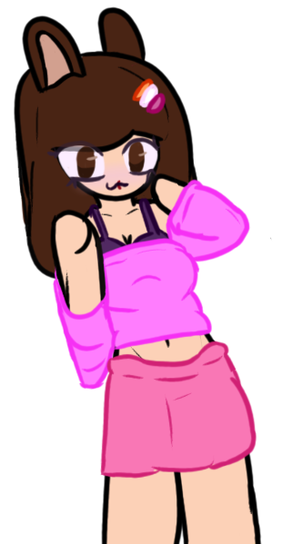

<!-- Title: About superpowers04 -->
# About me for Superpowers04
[A list of recommendations, warnings and a general resource/doc I made for modding Minecraft](https://git.gay/superpowers04/superpowers04/wiki/MC-Info) 
#### TL;DR: I am funni 20 year old transfem/translesbian/transbean who likes coding, drawing, video games and has ADHD/OCD(Actually tested) but apparently not autism
 * She/her
I have partially migrated over to https://git.gay/superpowers04/ with all of my IMPORTANT repos already moved over.
 Most of my older repos, non-important repos, github specific forks and backup of my current repos will be available at https://github.com/superpowers04
 I have a codeberg but it's unmaintained since git.gay has more features... and is gay :3
 A site is inevitable and WILL happen

Current inaccurate :c representation of myself: 

# Basic biography
I am currently a Minecraft Community Support Helper that is probably inactive a lot more than I should be and I am an admin for the Psych Engine Discord

> [!CAUTION]
> <b>Due to events being caused by a comic causing me to question a lot about myself, anything beyond this point might not be accurate at the moment, If you're curious about something, please directly ask me about it.</b> 
> * The comic is [<i>Rain</i>](https://comicfury.com/comicprofile.php?url=rain), it's a good comic you should read. You might want to read it across multiple days, not all in one 17-20 hour sitting like I did, else it'll hit you like a ton of bricks
 

> [!CAUTION]
> **If you're going to DM me, PLEASE let me know if you're over 18 and if so, whether NSFW content does or doesn't bother you.**
* If I say something that bothers you, Please let me know. I'm not the best at picking up if I said something bothersome.
* If you have a question or need help with something, Please send me the question instead of saying that you need help or pinging me
  - It makes response times from me faster because I can immediately respond to you instead of having to respond and then wait for you to type out your message 
  then it's a question about if you can get your Minecraft Java Account back because it got hacked and I have to inform you that I do not work for Mojank and then you get mad at me because you had to wait 5 hours for a response because I was ASLEEP a- wait, what was I talking about again? oh right
* ### I don't work for Mojang
  * None of the helpers or admins in Minecraft Community Support are affiliated with Mojang or Microsoft. We cannot help with account issues or recover your account. Please contact Microsoft or Mojang, all I can do is provide help for getting the funny little block game to work on your computer
* This goober forgets about the existance of people that haven't been interacted with in the past day. So if I randomly stop messaging you, don't take it personally, I do it to literally everyone ~~even family members~~

# Info about me
* Name: Steph/Stephanie  (I use this as an online name, I don't actually go by this name IRL)
* Gender: woman (Transfem/Transgener MTF)
* Age: Subtract May, 2005 from current date
* Romantic/Sexual interests: Demiromantic I think + Lesbian
* Goal in life ig?: To have fun and attempt to make people's days better, I'm not the best at it and it's kinda cliche but I hope I'm atleast getting somewhere
* Relationship Status: Single and not really interested in one at the moment
* Interests: Programming, Drawing, Minecraft, NSFW content(hence the disclaimer above, please read it), ~~your mother~~

> [!NOTE]
> I have an OC named Stephanie Purpurella, she is not representative of me. She was SUPPOSED to be but then I started changing things about her and she eventually stopped being a representation of me
# The links to places I exist
- [Discord](https://discordapp.com/users/267737465152864256)(Or my username is superpowers04. I am most active here)
- [Tumblr](https://www.tumblr.com/superpowers04)/[Tumblr Blog](https://superpowers04.tumblr.com/)
- [Pronouns.page](https://en.pronouns.page/@superpowers04)
- [Github](https://github.com/superpowers04)(i.e the page you're looking at)
# Main Projects
* [Super Engine](https://github.com/superpowers04/Super-Engine) - What started out as an extension to Kade Engine 1.4.2 is now a custom FNF engine by me that features a bunch of moddability without source code, options to add new charts and characters without touching a single line of code, a whole bunch of customization options, basic support for charts from Psych Engine, VSlice(0.3.0+ base funkin') and a whole bunch of other engines, all with a new input engine I designed myself and a whole slew of random shit I rewrote. As of writing this, I've been working on this piece of shit for like 3 years(Started late 2021, before Psych Engine even existed !!!!) 
* [Extura](https://github.com/superpowers04/Extura) - A personal fork of [ConstantDust's Figura Fork](https://github.com/ConstantDust/Figura) that adds a bunch of random things I want to add

